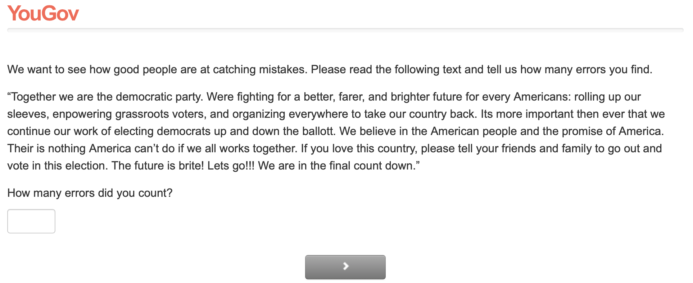
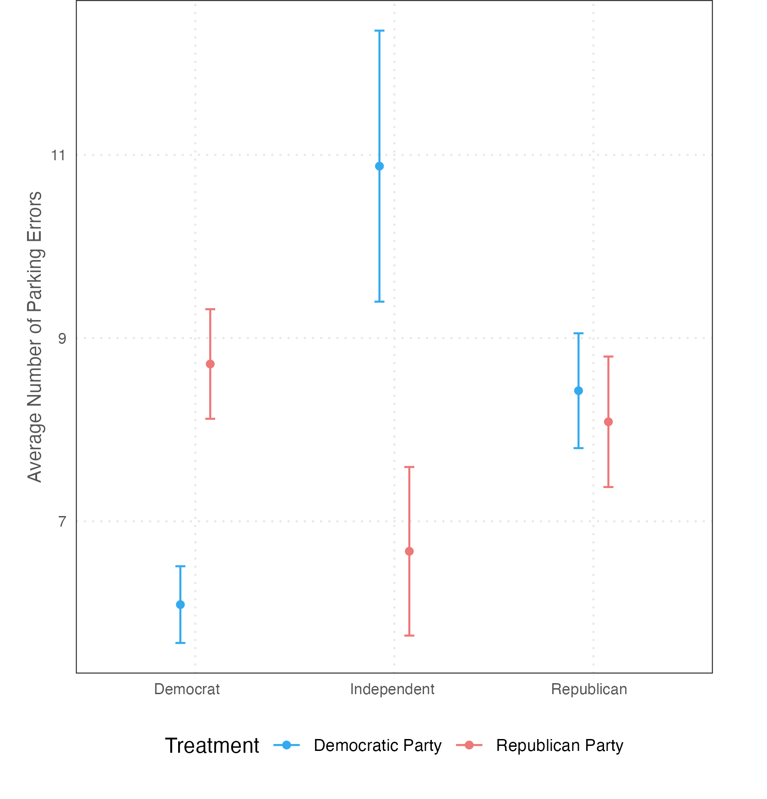

## Partisan Vision? Partisan Bias in Simple Visual Evaluations

Do partisans `see' different things? We test the hypothesis using simple evaluation tasks. We manipulate the perceived partisanship of people who have [written a piece of text](data/treats/Mistakes_Dem.png) or [parked the cars](data/treats/Parking_Lot_Dems.png) and ask respondents to estimate the number of errors. 

We find that partisan bias is generally small. In the CCES survey, the average number of mistakes found by Democrats in Democratic texts is 9.7 (.2) vs. 9.9 (.2) in Republican texts. On the flip side, Republicans on average find 8.40 (.3) mistakes in Democratic texts and 8.1 (.3) in Republican texts. Moving to judgments about errors in parking, we find that Democrats on average find 6.1 (.4) misparked cars when they think Democrats parked the cars vs. 8.72 (.6) when they think Republicans parked the cars. The difference here is statistically significant but the sharply smaller difference between the medians suggests that the effect is due to a small number of extreme observations. Moving to Republicans, they find on average 8.4 (.6) misparked cars when they think Democrats parked the cars vs. 8.1 (.7) when they think Republicans parked the cars. 

When we replicated the experiment on finding errors in text on Lucid, we found a similar pattern. Democrats find 5.47 (.61) errors on average when they think Democrats wrote the text vs. 5.91 (.79) when they think Republicans wrote it. On the Republican side, the corresponding numbers are 5.58 (.89) (when they think Democrats wrote the text) vs. 4.86 (.26) (when they think Republicans wrote it).

Lastly, on a survey on Amazon Mturk, we asked respondents to count [how many people are wearing a mask at a Trump rally](data/treats/trump_rally.mp4). Because of some absurd estimates, e.g., 80,000, we winsorized the data. Democrats on average spot 5.4 (.3) masks and Republicans spot 5.9 (.3) masks. The 25th percentile of Democrats' and Republicans' estimates is 2, the 50th percentile for Democrats and Republicans are 4 and 5 respectively, and the 75th percentile are 7 and 8 respectively. 

### Treatments

[Trump Rally](data/treats/trump_rally.mp4)

### Results

**CCES**

**Lucid**

**MTurk**

Number of people wearing masks by party 

|pid_dem_l   | p_25| p_50| p_75|   n|     mean| std_error|
|:-----------|----:|----:|----:|---:|--------:|---------:|
|democrat    |    2|    4|  7.0| 237| 5.4|       0.3|
|independent |    1|    2|  6.5|  15| 4.9|       1.4|
|republican  |    2|    5|  8.0| 365| 5.9|       0.3|

### Authors

Carrie Roush, Gaurav Sood, and Alex Theodoridis
