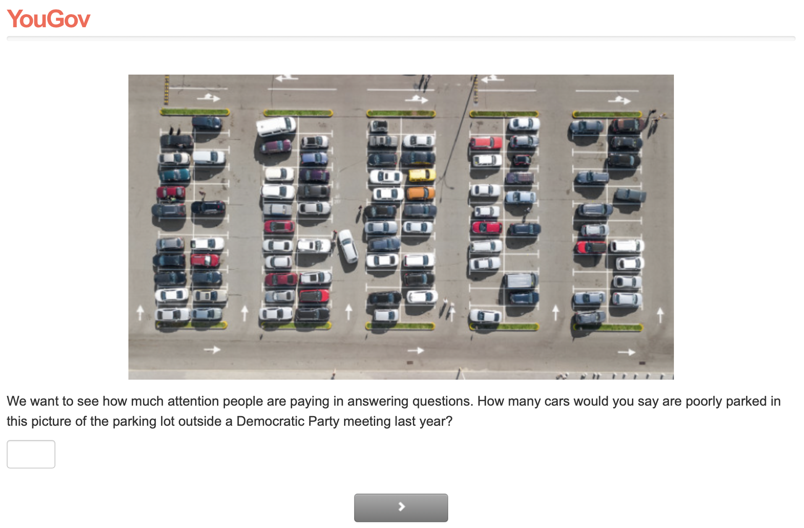
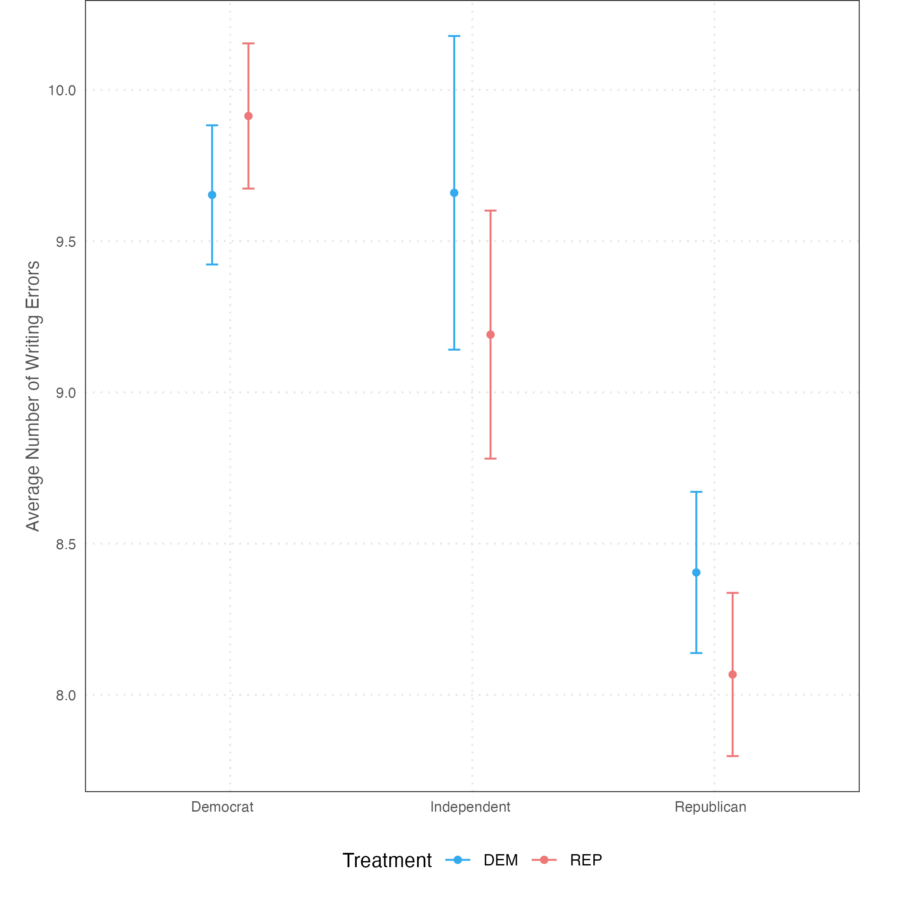
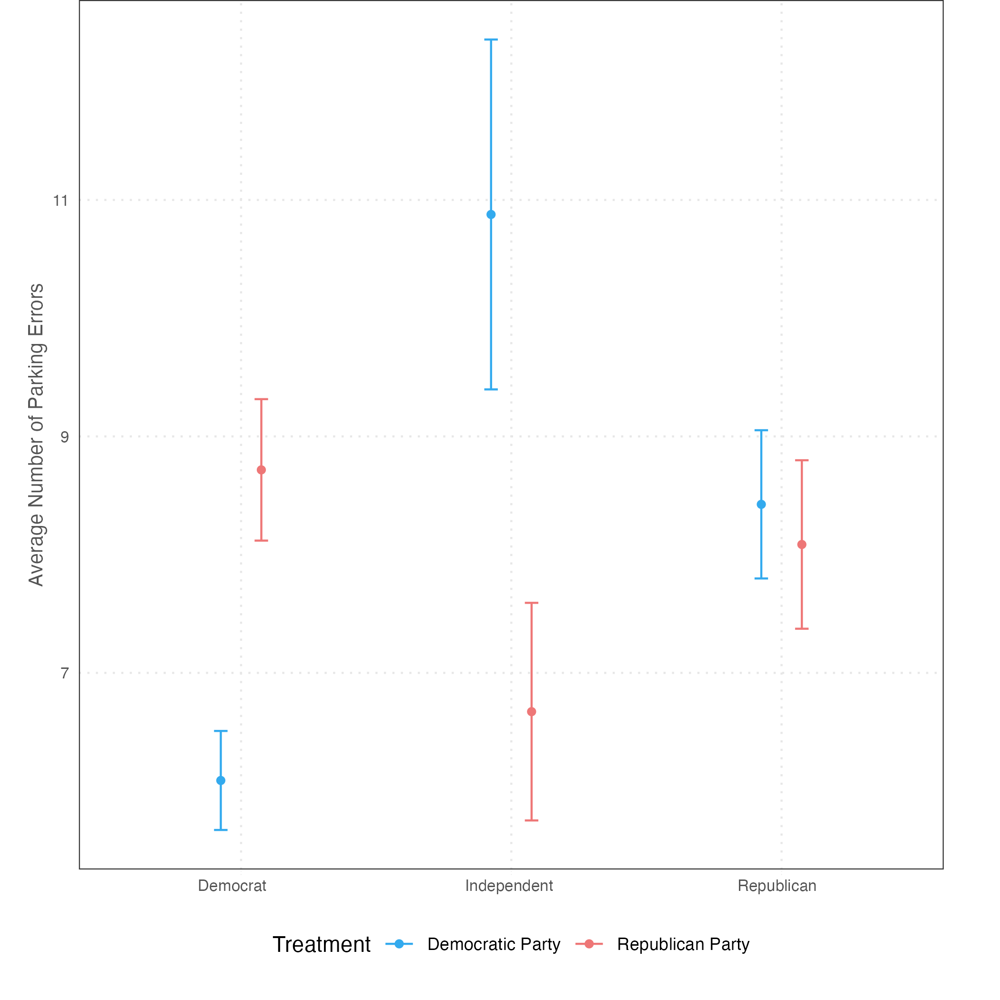

## Partisan Vision? Impact of Partisanship on Visual Evaluative Tasks

Do partisans `see' different things? We test the hypothesis using simple evaluation tasks. In two survey experiments, we manipulate who has [written a piece of text](data/treats/Mistakes_Dem.png), and [parked the cars](data/treats/Parking_Lot_Dems.png) and ask respondents to estimate the number of errors. In a survey, we ask respondents to count [how many people are wearing a mask at a Trump rally](data/treats/trump_rally.mp4). We find that partisan bias is generally small.

### Results

## Number of people wearing masks by party 

|pid_dem_l   | p_25| p_50| p_75|   n| std_error|
|:-----------|----:|----:|----:|---:|---------:|
|democrat    |    1|    1|    5| 919|         3|
|independent |    1|    1|    5| 111|         3|
|republican  |    2|    2|    6| 879|         4|

### Authors

Carrie Roush, Gaurav Sood, and Alex Theodoridis
